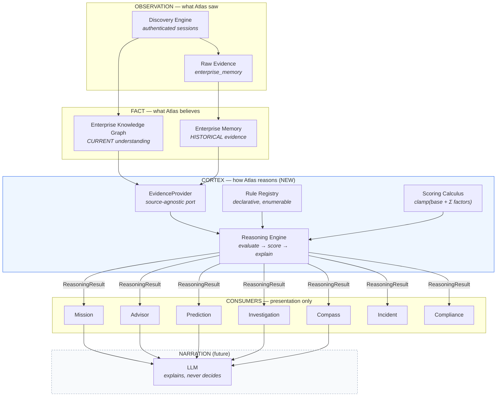
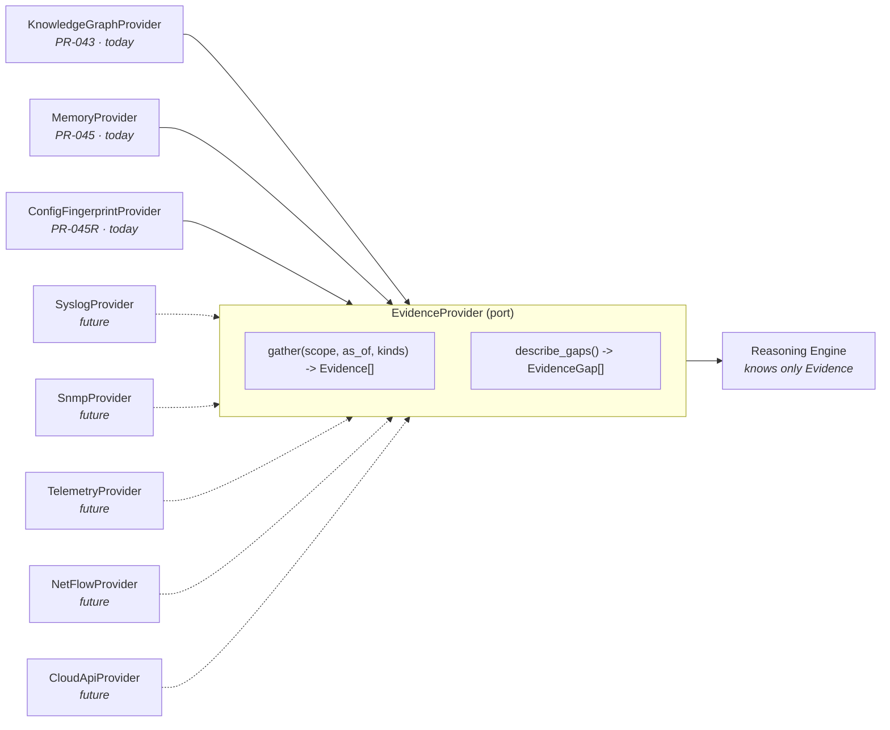
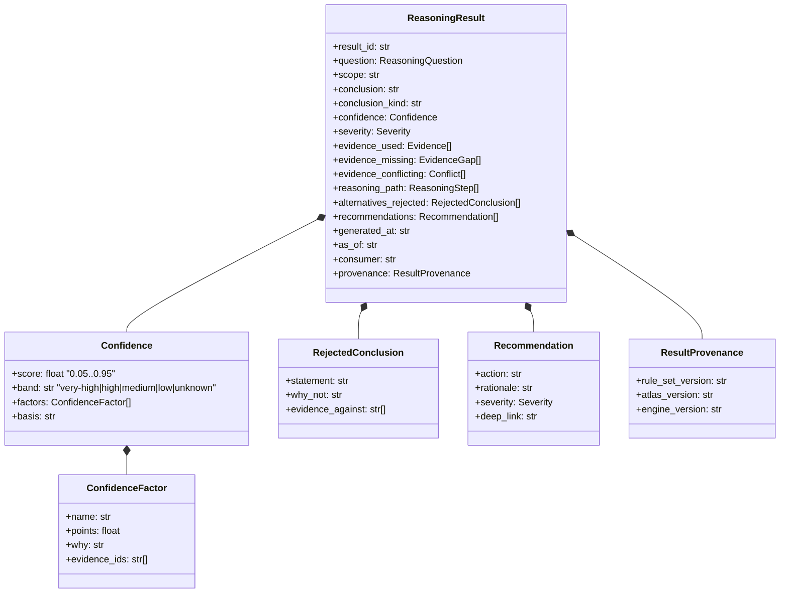
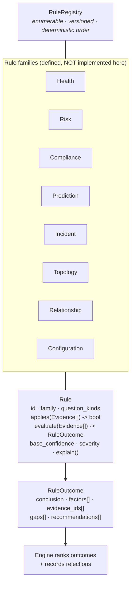
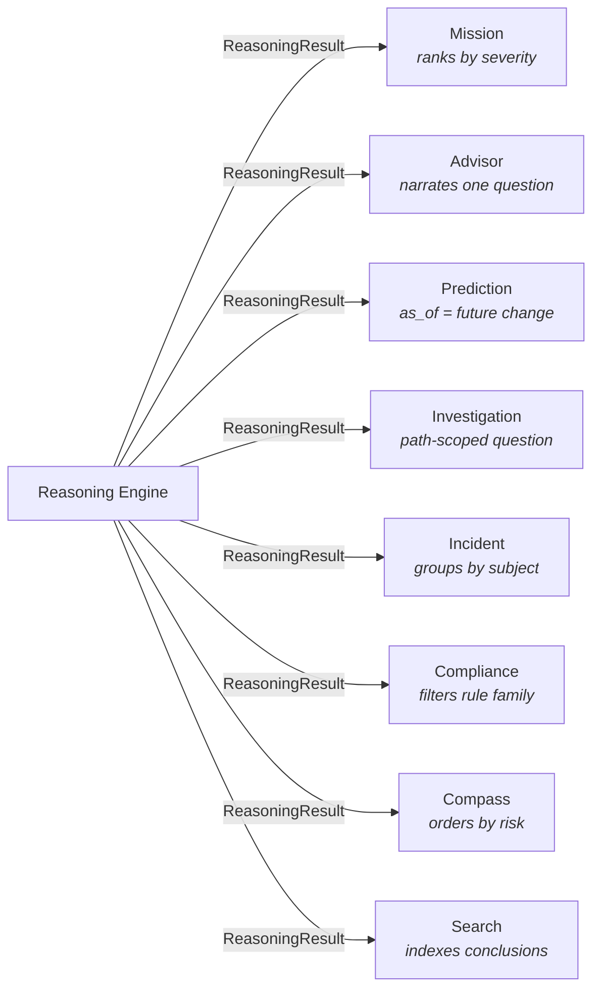
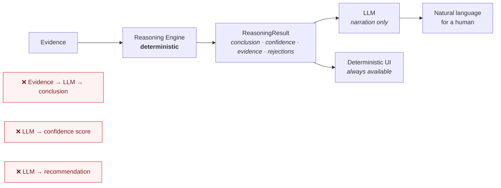
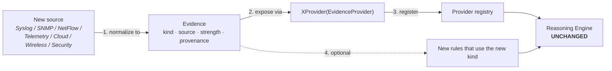

# Atlas Enterprise Reasoning Framework (CORTEX)

**Status:** Architecture proposal — *not implemented*
**PR:** 046 · **Supersedes:** nothing · **Depends on:** PR-043 (Knowledge Graph), PR-045 (Enterprise Memory)
**Audience:** contributors and AI coding agents, *before* writing reasoning code

---

## 0. Executive summary

Atlas already reasons well. Eight engines produce evidence-backed, banded,
explainable conclusions, and none of them invent facts. The problem is not
quality — it is **that each engine independently invented the same three
things**: a scoring formula, a result shape, and an evidence vocabulary.

This document proposes the **Enterprise Reasoning Framework (CORTEX)**: a
small, shared kernel that every module reasons *through*, so that Atlas has
one definition of confidence, one result schema, and one explanation contract.

The central finding of the review:

> **The shape of Atlas's reasoning is already universal. Only the
> implementation is duplicated.**
>
> All eight scorers compute `clamp(base + Σ named factors)`. All four result
> types express *conclusion / confidence / evidence used / evidence missing /
> reasoning path*. Nobody disagrees about the model — they disagree about the
> code.

CORTEX therefore is **an extraction, not a rewrite**. It does not change a
single conclusion Atlas reaches today. It gives those conclusions one spine.

**This PR delivers the design only.** No engine is rewritten here, and two
findings (§1.4) argue that parts of Mission must be *moved* before anything is
built on top of them.

---

## 1. Part 1 — Current state analysis

### 1.1 Strengths (what must be preserved)

These are real assets. The framework must not regress them.

| Strength | Evidence |
|---|---|
| **Reasoning is already deterministic** — no randomness, no wall-clock in business logic | injected clocks throughout; every engine documents its arithmetic |
| **Confidence never claims certainty** — a 0.95 cap is honoured across engines | `root_cause/confidence.py`, `prediction/confidence.py`, `correlation/engine.py` |
| **Arithmetic is documented in prose, at the top of each module** | e.g. `root_cause/confidence.py:1-14` |
| **Unknown stays unknown** — engines emit `unresolved`/`unknowns`/`missing_evidence` rather than guessing | `UnresolvedObservation`, `AdvisorResponse.unknowns`, `HopResult.missing_evidence` |
| **A shared band vocabulary already exists** | `root_cause.confidence.band` imported by 5 modules |
| **A shared *graph* contract already exists** | `EnterpriseKnowledge` (PR-043.8) |
| **Evidence carries provenance** — source command, priority, observed-by | `correlation` evidence items; PR-045R raw-evidence metadata |

The team has already reached for unification twice (the band vocabulary and
the Graph Consumer Contract). **CORTEX is the third and general case.** The
instinct is proven; it just needs a home.

### 1.2 The core duplication: eight scoring models, one shape

| # | Location | Formula | Range | Bands? |
|---|---|---|---|---|
| 1 | `root_cause/confidence.py:29` | `base + .08·supporting − .15·contradicting + .15·iface + .05·recurring − .10·stale` | 0.05–0.95 | yes |
| 2 | `prediction/confidence.py` | `.50 + .15·topo + .10·fresh + .10·cfg + .05·hist + .05·evaluator − .10·unknown − .15·contra` | 0.05–0.95 | yes (borrowed) |
| 3 | `correlation/engine.py:486` | `CONFIDENCE_BASE[priority] + CORROBORATION_BONUS·(kinds−1)` | cap 0.95 | no |
| 4 | `federation/models.py:26-28` | fixed constants `.95 / .75 / .90` | — | yes (borrowed) |
| 5 | `enterprise/knowledge.py:301` | **qualitative band only — no score** | n/a | own vocabulary |
| 6 | `enterprise_intelligence/health.py:143` | `clamp(100 + Σ factor.points)` | 0–100 | no |
| 7 | `prediction/risk.py:51` | thresholds `50 / 30 / 15` | 0–100 | own vocabulary |
| 8 | `enterprise/network_identity.py` | weighted Jaccard + serial floor | 0–100 | yes |

Read the *formulas*, not the modules. Every one is:

```
score = clamp(base + Σ (named, signed, documented factor))
```

They differ in base, in range, in sign convention, and in what they call a
factor — but **not in kind**. Two of them (#1, #2) even share the same
semantic factors under different names:

| Abstract factor | root_cause calls it | prediction calls it |
|---|---|---|
| corroborating evidence (+) | `supporting` | `topology_available`, `configuration_captured`, `history_available` |
| contradicting evidence (−) | `contradicting` (−0.15) | `contradictions` (−0.15) |
| staleness (−) | `stale` (−0.10) | `fresh` (+0.10) |
| missing evidence (−) | — | `unknown_layers` (−0.10) |
| direct/strong observation (+) | `interface_match` (+0.15) | — |

**They agree on the weight of a contradiction (−0.15) by coincidence, not by
contract.** Nothing prevents the next engine from choosing −0.30.

`CONFIDENCE_FLOOR = 0.05` and `CONFIDENCE_CAP = 0.95` are **defined literally
twice** (`root_cause/confidence.py:24-25`, `prediction/confidence.py`).

### 1.3 The second duplication: four result shapes, five concepts

| Concept (Part 4 mandate) | Advisor | Path Investigation | Prediction | Root Cause |
|---|---|---|---|---|
| Conclusion | `summary` | `failure_summary` / `status` | — | `statement` |
| **Confidence** | `confidence: str` ⚠ **band only** | `confidence: float` | `score` + `band` | `confidence` + `band` |
| Evidence used | `evidence: EvidenceItem[]` | `hops[].evidence` | `factors` | `supporting: str[]` (ids) |
| Evidence missing | `unknowns: str[]` | `hops[].missing_evidence` | `unknown_layers: int` | — |
| Contradicting | — | — | `contradictions: int` | `contradicting: str[]` |
| Reasoning path | `steps: str[]` | `steps: InvestigationStep[]` | `factors` | `next_step` |
| Recommendations | `followups` | `recommendations: str[]` | — | `next_step` |
| Severity | — | `failure_type` | — | — |
| Timestamp | `generated_at` | `generated_at` | — | — |

**No two agree. None has all nine.** Concrete consequences already in the code:

- **Advisor discards the numeric score.** `AdvisorResponse.confidence` is a
  `str`. Advisor cannot say "72%" even when the engine computed it, and
  `confidence_from_band()` (`advisor/models.py:27`) *collapses* `very-high` →
  `High`. Information is destroyed at a module boundary.
- **Three vocabularies coexist**: `very-high|high|medium|low` (root_cause),
  `high|medium|low` (`enterprise/knowledge.py:38`), `High|Medium|Low`
  (`advisor/models.py:19`) — requiring a translator between them.
- **Root Cause has no timestamp; Prediction has no conclusion field.**

### 1.4 Coupling and misplacement (the two findings that block building)

**Finding A — the reasoning kernel lives inside a leaf module.**

```
compass ─────┐
federation ──┤
path_intel ──┼──► root_cause.confidence.band     ← a cross-cutting primitive
prediction ──┘                                      owned by an analysis module
```

Five modules import a shared primitive from `root_cause/` — a *sibling
analysis engine*, not a kernel. `prediction → root_cause` is a nonsense
dependency direction: prediction does not depend on root-cause analysis, it
depends on a confidence vocabulary that merely happens to live there. This is
**kernel-by-squatting**. It works today and will not survive a tenth module.

**Finding B — Mission's reasoning lives in the presentation layer.**

`web/mission.py` is 300 lines containing `build_recommendations()`. Mission is
not a view over an engine; **it *is* an engine, inside `web/`.** Business
reasoning in the web package cannot be reused by the CLI, cannot be tested
without Flask, and cannot be consumed by a future API or LLM.

This is also *precisely* where this session's two real bugs lived (the
"could not reach 245 host(s)" miscount and `recurring_unstable_hosts`
counting unused addresses) — bugs that 1113 green tests missed because the
logic was in a template-adjacent layer nobody reasoned about as an engine.
**That is the cost of Finding B, already paid, twice.**

**Finding C — the proven shared contract never spread.**

`EnterpriseKnowledge` (PR-043.8's "one Graph Consumer Contract") is imported
by exactly **two** consumers: `advisor/engine.py` and `dashboard/summary.py`.
`prediction`, `path_intelligence`, `compass`, `root_cause` and `federation`
each reach for the graph their own way. The right abstraction exists and was
not adopted — a warning that **publishing a contract is not the same as
retiring the alternatives** (see §12 roadmap, and §13 risk R2).

### 1.5 Missing abstractions

1. **No `Evidence` type.** Evidence is a `str` in root_cause (`supporting:
   tuple[str]` — ids), an `EvidenceItem` in Advisor, a `dict` in correlation,
   a `ConfidenceFactor` in prediction. There is no shared notion of "a thing
   Atlas observed, from a source, at a time, with a strength."
2. **No `ReasoningResult`.** §1.3.
3. **No rule abstraction.** Rules are `if` statements inside engines, so they
   cannot be enumerated, tested in isolation, or explained as "rule X fired."
4. **No "why not?" .** Nothing records rejected conclusions (Part 7 mandate).
5. **No reasoning-level provenance.** PR-045R gave *evidence* strong
   provenance; *conclusions* have none — you cannot ask "which Atlas version
   and which rule set produced this recommendation?"

### 1.6 Future risks if unaddressed

| Risk | Consequence |
|---|---|
| Nth engine invents an Nth confidence formula | "High" means different things on different pages — an operator trust failure, and an *unfalsifiable* one |
| Advisor's band-only confidence | any future consumer of Advisor inherits the information loss |
| Reasoning in `web/` | no API, no CLI, no LLM can consume Mission; bugs hide (§1.4B) |
| No rule registry | compliance/incident engines will hard-code rules again |
| No `Evidence` type | every new source (Syslog/SNMP/telemetry) forces N engine edits |
| LLM added before a result schema | the LLM would read prose, and would *invent* — the exact failure mode the product forbids |

---

## 2. Part 2 — The reasoning architecture

### 2.1 Layer diagram (Discovery → Knowledge → Memory → Reasoning → Modules → AI)



**The load-bearing rule of this diagram: arrows never point backwards.**
Modules do not reason. The engine does not render. The LLM does not decide.

### 2.2 Separation of concerns (contract, not convention)

| Layer | Owns | Must never |
|---|---|---|
| Knowledge Graph | *current* understanding | store history |
| Enterprise Memory | *historical* evidence | compute current topology |
| **CORTEX** | turning evidence into scored, explained conclusions | fetch evidence itself; render; know a module exists |
| Modules | presenting a `ReasoningResult` for one audience | compute confidence; invent a rule |
| LLM | wording a conclusion already reached | reach a conclusion |

The Memory ↔ Knowledge separation was verified clean in PR-045R and this
framework **must not become the thing that couples them.** CORTEX depends on
both only through `EvidenceProvider` (§3), never on their internals.

### 2.3 Lifecycle of a reasoning request

```mermaid
sequenceDiagram
  participant U as Operator / Module
  participant Q as ReasoningRequest
  participant E as Reasoning Engine
  participant P as EvidenceProvider(s)
  participant R as Rule Registry
  participant S as Scoring Calculus
  participant Res as ReasoningResult

  U->>Q: question + scope + as_of
  Q->>E: evaluate(request)
  E->>P: gather(scope, as_of)      Note right of P: KG + Memory + future sources
  P-->>E: Evidence[] (+ what was UNAVAILABLE)
  E->>R: rules matching question kind
  R-->>E: Rule[] (ordered, deterministic)
  loop each rule
    E->>E: rule.applies(evidence)?
    E->>S: factors → clamp(base + Σ)
    S-->>E: score + band + factor trace
  end
  E->>E: rank candidates; record REJECTED ones + why
  E-->>Res: conclusion · confidence · evidence used/missing<br/>reasoning path · alternatives rejected · recommendations
  Res-->>U: one schema, every module
```

Four properties fall out of this lifecycle and are worth naming:

1. **Evidence gathering is a separate step.** Rules never fetch. This is what
   makes a new evidence source (§10) a *configuration* change, not an engine
   change.
2. **What was *unavailable* is a first-class return value**, not an absence.
   "Unknown stays unknown" becomes structural.
3. **Rejected candidates are recorded during ranking**, not reconstructed
   afterwards — the only way "why not X?" (Part 7) can be honest.
4. **Scoring is called by the engine, never by a rule.** A rule declares
   factors; it does not get to decide what a factor is worth. This is the
   single change that makes "High" mean one thing.

---

## 3. Part 3 — Reasoning inputs (the source-agnostic port)

The engine must not know that SSH, or a graph, or a JSON file exists.



**`Evidence` — the missing type (§1.5.1).** One shape for everything Atlas
observed, regardless of origin:

```
Evidence
  id            stable, content-addressed where possible
  kind          ospf-neighbor | interface-ownership | config-fingerprint |
                syslog-event | snmp-poll | flow-record | …   (open vocabulary)
  source        cli | syslog | snmp | netflow | telemetry | cloud   (PR-045 SOURCE_*)
  subject       canonical device id / relationship / network
  observed_at   when the NETWORK showed it
  recorded_at   when ATLAS learned it        ← already distinguished in PR-045R
  strength      DIRECT | CORROBORATING | CIRCUMSTANTIAL | ABSENT
  provenance    session id · command · parser_version · atlas_version
  payload       normalized, source-specific (never raw secrets)
```

`strength` is the bridge from today's ad-hoc scoring to §6: it is the only
thing the calculus needs to know about an evidence item, so a rule never has
to care whether a fact came from OSPF or Syslog.

**`EvidenceGap` — absence as data.** `kind`, `subject`, `why`
(*not-collected | unreachable | unsupported-platform | not-modelled*), and
`impact_on_confidence`. This is how `unknowns` / `missing_evidence` /
`unknown_layers` (three names today) become one thing.

---

## 4. Part 4 — The common result schema



Design notes, each earning its place from §1.3:

- **`Confidence` is always score *and* band.** Fixes Advisor's lossy `str`.
  Bands are *derived*, never stored independently — one function, one truth.
- **`alternatives_rejected` is mandatory** (may be empty, never absent).
  Part 7's "why not another conclusion?" is otherwise unanswerable.
- **`evidence_conflicting` is separate from `missing`.** Conflict and absence
  are different epistemic states and today are conflated.
- **`as_of` vs `generated_at`.** Reasoning over Memory is time-travel
  ("what did we conclude about yesterday?"). Without `as_of`, historical
  reasoning is not expressible — and Memory (PR-045) exists precisely to make
  it possible.
- **`provenance`** answers "which rules/version concluded this?" (§1.5.5) —
  the conclusion-level analogue of PR-045R's evidence provenance.
- **`consumer`** is a *label*, not a behaviour switch. The engine must produce
  the identical result regardless; the field exists for audit only.
  *If this field ever changes a conclusion, the framework has failed.*

---

## 5. Part 5 — Rule framework (architecture only)



**A rule is a pure function of evidence.** It may not fetch, may not render,
may not compute a final score — it *declares named factors* and the engine
prices them. Rules are registered, so Atlas can answer "what rules exist?" and
test each in isolation — impossible today (§1.5.3).

**Explicitly not in this PR:** the rules themselves. Migrating the ~8 existing
scorers into rule families is roadmap §12, and every migration must be
proven behaviour-preserving before it lands.

---

## 6. Part 6 — The confidence model (the scoring calculus)

The kernel primitive, derived directly from the eight existing formulas:

```
score = clamp(base + Σ factor.points, FLOOR, CAP)
band  = f(score)
FLOOR = 0.05      CAP = 0.95      ← never certainty; already Atlas doctrine
```

**Bands (single definition, from `root_cause/confidence.py`, promoted):**

| Band | Range |
|---|---|
| very-high | ≥ 0.90 |
| high | ≥ 0.72 |
| medium | ≥ 0.50 |
| low | < 0.50 |
| unknown | no evidence at all |

`unknown` is added deliberately: `enterprise/knowledge.py` already needs it
("no discovery evidence exists yet") and today expresses it outside the shared
vocabulary.

**The standard factor vocabulary** — the abstraction over §1.2's table. These
weights become **contract**, replacing today's coincidental agreement:

| Factor | Sign | Meaning |
|---|---|---|
| `DIRECT_OBSERVATION` | + | Atlas saw it on the device itself |
| `CORROBORATION` | + | an independent source agrees (diminishing, capped) |
| `CONTRADICTION` | − | sources disagree |
| `STALENESS` | − | evidence older than the freshness window |
| `MISSING_EVIDENCE` | − | a gap that bears on this conclusion |
| `NOT_MODELLED` | − | a layer Atlas does not represent |

**Confidence must depend on evidence, never on severity or desirability.**
`enterprise/knowledge.py:303` already states this ("driven by completeness…
NOT by health"). CORTEX makes it structural: `Severity` and `Confidence` are
different fields, computed from different inputs, and a rule cannot reach the
scorer to bias one with the other.

**Worked validation — the two live formulas expressed in the calculus** (paper
proof that the primitive is sufficient; no code):

*root_cause* `base .60, 2 supporting, 1 contradicting, iface match, stale`
→ `.60 + (.08×2) + (−.15×1) + .15 + (−.10) = .66` → **medium**
as factors: `[DIRECT_OBSERVATION +.15, CORROBORATION +.16, CONTRADICTION −.15, STALENESS −.10]` over base `.60`.

*prediction* `base .50, topology, fresh, config, 1 unknown layer`
→ `.50 + .15 + .10 + .10 + (−.10) = .75` → **high**
as factors: `[CORROBORATION +.35 (3 sources), MISSING_EVIDENCE −.10]` over base `.50`.

Both are `clamp(base + Σ named factors)`. **The primitive reproduces both
without loss** — which is the evidence that this extraction is safe, and the
first thing an implementation must prove with a characterisation test (§12).

---

## 7. Part 7 — Explainability

Every `ReasoningResult` must answer five questions **from its own fields**,
with no recomputation:

| Question | Answered by |
|---|---|
| Why? | `reasoning_path` + `conclusion` |
| Which evidence? | `evidence_used[]` (with provenance to the exact command + session) |
| Which observations? | `Evidence.observed_at` / `recorded_at` / `source` |
| Which rules? | `reasoning_path[].rule_id` + `provenance.rule_set_version` |
| Why not another conclusion? | `alternatives_rejected[]` ← **not possible today** |

**The doctrine:** Atlas must never produce an unexplained recommendation. In
practice this means the schema makes silence *impossible*: a result with an
empty `evidence_used` cannot carry a band above `unknown`, and a
`Recommendation` without a `rationale` is invalid. Explainability enforced by
the type, not by reviewer discipline.

---

## 8. Part 8 — Module contracts

**Every module becomes a presentation layer over the same engine.**



| Module | Question it asks | Presentation-only job | Today's gap |
|---|---|---|---|
| **Mission** | "is the enterprise healthy?" | rank + summarise | **reasoning lives in `web/mission.py`** (§1.4B) |
| **Advisor** | operator's NL question → `ReasoningQuestion` | narrate + follow-ups | discards the score (§1.3) |
| **Prediction** | "what if X?" (`as_of` = hypothetical) | show impact | own scorer |
| **Investigation** | "why can't A reach B?" | hop narrative | own scorer + own result |
| **Incident** | "what is broken now?" | group by subject | package exists, not on the framework |
| **Compliance** | "does X meet policy?" | filter a rule family | **does not exist** — greenfield, must be born on CORTEX |
| **Compass** | "what should I change?" | order by risk | own scorer |
| **Search / Changes / History** | retrieval | index results | no reasoning; keep it that way |

**The contract in one line:** a module may *choose the question* and *render
the answer*. It may not compute confidence, invent a rule, or reach past the
engine to the graph.

**Compliance is the acceptance test for this design.** It is the only major
consumer not yet written. If Compliance cannot be built as a rule family + a
presentation layer, with zero new scoring code, CORTEX has failed and should
be revised before the existing engines are touched.

---

## 9. Part 9 — AI integration



**The LLM explains; it never decides.** Constraints, in priority order:

1. The LLM's **input is a `ReasoningResult`**, never raw evidence. It cannot
   reach a conclusion because it is never shown the material to reach one
   from.
2. The LLM **may not alter** `conclusion`, `confidence`, `severity`, or
   `recommendations`. It may only re-word them.
3. **Every LLM-narrated answer must degrade to the deterministic result** if
   the model is unavailable, disabled, or disagrees. The UI path from `RES` to
   `UI` above is not a fallback — it is the primary path.
4. **The LLM is never in the confidence loop.** A model's fluency is not
   evidence, and must never move a band.
5. Narration is **auditable**: store the `result_id` the narration came from.

This is why §4's schema must land *before* any LLM work: the schema is the
mechanism that makes the LLM structurally unable to invent. Add the LLM first
and Atlas's core promise — evidence-backed, deterministic, explainable — is
lost on day one, and lost invisibly.

---

## 10. Part 10 — Future extensibility

A new evidence source must be **a new provider, not an engine change**:



The test of this design: **adding Syslog requires zero edits to the engine,
to the calculus, or to any module.** A syslog line becomes `Evidence(kind=
"syslog-event", source="syslog", strength=CIRCUMSTANTIAL, …)`; existing rules
that ask for corroboration receive it automatically; new rules are additive.

PR-045 already reserved `SOURCE_{SYSLOG,SNMP,NETFLOW,TELEMETRY}` and a
per-record `metadata` dict, and PR-045R reserved the transport vocabulary —
**the storage half of this is already done.** CORTEX supplies the reasoning
half.

---

## 11. Part 11 — Reference scenarios (design validation)

Each scenario is traced against the design. These are the acceptance criteria.

### "Why is BGP down?"
`ReasoningQuestion(kind=DIAGNOSE, subject=bgp-session, scope, as_of=now)`
→ providers return OSPF/BGP evidence (KG) + config fingerprint history (Memory)
→ Incident/Relationship rules fire
→ result: conclusion *"BGP to 10.4.255.1 is down because eth1 is
administratively shut"*, factors `[DIRECT_OBSERVATION +.15, CORROBORATION
+.08]`, **`alternatives_rejected`: "peer unreachable — rejected, ICMP evidence
absent (gap, not proof)"**.
✅ Exercises: rejection recording, gaps ≠ disproof.

### "What changed yesterday?"
`as_of=yesterday` → **MemoryProvider only**; the KG is not consulted.
✅ Exercises: `as_of` time-travel, and the Memory/Knowledge separation —
this scenario is *impossible* without both §2.2 and PR-045.
⚠️ Requires the config fingerprint (PR-045R) to shortlist candidates cheaply.

### "Which devices are unhealthy?"
Health rule family over KG evidence → **many results, one per device**, ranked
by `severity`; Mission renders.
✅ Exercises: the module-as-presentation contract — and would have prevented
both §1.4B bugs, because "unused address" is an `EvidenceGap`, structurally
incapable of becoming a health penalty.

### "What will happen if I remove this route?"
`kind=PREDICT`, `as_of` = hypothetical → Prediction rules → result with
`confidence` from the *same* calculus and `evidence_missing` = ["service
dependencies not modelled"] (`NOT_MODELLED −.10`).
✅ Exercises: prediction as a question, not a bespoke engine.

### "Why is this recommendation High confidence?"
Pure schema read: `confidence.factors[]` + `evidence_used[]` +
`reasoning_path[]` — **no recomputation.**
✅ This scenario is the whole thesis. It is *unanswerable today in Advisor*,
which holds only the string `"High"`.

---

## 12. Recommended implementation roadmap

Ordered so that **nothing is rewritten before the framework is proven.**

| Phase | Deliverable | Exit criteria |
|---|---|---|
| **0. Kernel home** | `founderos_atlas/reasoning/` package. Move the band vocabulary out of `root_cause/` (fix §1.4A). Re-export from `root_cause` so nothing breaks. | 5 importers unchanged; full suite green |
| **1. Calculus** | `Confidence`, `ConfidenceFactor`, `clamp(base+Σ)`, one `band()` | **Characterisation tests: the calculus reproduces `root_cause.calculate` and `prediction.assess_confidence` byte-for-byte** (§6 worked proof, executed) |
| **2. Types** | `Evidence`, `EvidenceGap`, `ReasoningResult`, `ReasoningQuestion` | schema round-trips; no engine consumes them yet |
| **3. Ports** | `EvidenceProvider` + `KnowledgeGraphProvider` + `MemoryProvider` | providers reproduce what engines fetch today |
| **4. Engine + registry** | `evaluate(request)`, `RuleRegistry` | rules enumerable and individually testable |
| **5. PROVE IT — Compliance** | build the *new* Compliance module entirely on CORTEX | **zero new scoring code.** If this fails, revise the framework — do not proceed |
| **6. Migrate, one at a time** | Investigation → Prediction → Advisor → Mission | each: behaviour-preserving, characterisation-tested, old scorer deleted |
| **7. Mission relocation** | move `web/mission.py` reasoning into a rule family (fix §1.4B) | Mission testable without Flask |
| **8. Retire duplicates** | delete the 8 scorers; one calculus remains | `grep` finds one `clamp(`; one band function |
| **9. LLM narration** | only now | schema-in, prose-out; deterministic path still primary |

**Phase 5 is the gate, and it is deliberately placed before any migration.**
Compliance is greenfield: if CORTEX cannot carry a brand-new module cleanly,
it certainly cannot justify touching four working ones.

**Sequencing principle:** every migration must delete its predecessor. §1.4C
proved that publishing a contract while leaving alternatives alive produces
partial adoption — `EnterpriseKnowledge` has two consumers out of seven. **A
migration that does not delete the old scorer has not migrated anything.**

---

## 13. Risks

| # | Risk | Severity | Mitigation |
|---|---|---|---|
| **R1** | **Big-bang rewrite.** Four working engines replaced at once. | 🔴 High | Roadmap is strictly incremental; nothing is rewritten before Phase 5 proves the design on greenfield code |
| **R2** | **Partial adoption** — CORTEX becomes a 9th way to reason, exactly as `EnterpriseKnowledge` became a 3rd way to read the graph (§1.4C) | 🔴 High | Every migration deletes its predecessor (Phase 8); "one `clamp(`" is a measurable exit criterion |
| **R3** | **Behaviour drift** — unifying weights silently changes conclusions users trust | 🔴 High | Characterisation tests first (Phase 1); a deliberate weight change is a separate, announced PR |
| **R4** | **Over-abstraction** — a rule DSL nobody can read; reasoning becomes harder | 🟡 Medium | Rules stay plain Python functions; no DSL, no config language, no dynamic dispatch |
| **R5** | **Performance** — gather-then-reason may re-read evidence per request | 🟡 Medium | Providers cache per request (the `g._console_targets`/`_web_access` pattern already proven in `web/routes.py`) |
| **R6** | **LLM scope creep** — "just let it suggest one thing" | 🔴 High | Constraint 2 (§9) is a type boundary, not a guideline: the LLM's output type is `str`, never a `ReasoningResult` |
| **R7** | **Schema churn** — `ReasoningResult` changes after consumers adopt it | 🟡 Medium | Optional fields with defaults + `from_dict` tolerance (the PR-045R pattern, already proven backward compatible) |
| **R8** | **The framework outruns the evidence** — rules asserting more than Atlas can observe | 🟡 Medium | `EvidenceGap` is mandatory; a rule with no evidence yields band `unknown`, structurally |

---

## 14. Remaining questions (must be answered before Phase 1)

1. **Is confidence comparable across families?** Is a `high` health conclusion
   the same strength as a `high` prediction? *Recommendation:* yes for
   **presentation**, no for **arithmetic** — never average or combine scores
   across families. Needs an explicit ruling; it constrains Mission's ranking.
2. **Severity vs confidence in ranking.** Mission ranks by which first? A
   low-confidence critical vs a high-confidence medium? *Recommendation:*
   severity first, confidence as tie-break, and show both — but this is a
   product decision, not an architectural one.
3. **Should `Evidence` subsume the Knowledge Graph's own relationship
   confidence** (the 9-priority fusion, `correlation/engine.py:486`)? The
   fusion *is* reasoning, but it runs at discovery time, before CORTEX exists
   in the pipeline. *Recommendation:* leave it — it is correlation, not
   conclusion — but map its output onto `Evidence.strength` so CORTEX inherits
   it rather than recomputing it.
4. **Result persistence.** Should `ReasoningResult` be written to Enterprise
   Memory? Tempting (a conclusion timeline), but it risks Memory storing
   *interpretations* — violating §2.2 and PR-045's "collection is separate
   from interpretation." *Recommendation:* **no** for now; if a conclusion
   timeline is wanted, give it its own store keyed by `result_id`.
5. **Rule versioning.** When a rule's weights change, do historical results
   become wrong, or merely old? `provenance.rule_set_version` records it —
   but the re-evaluation policy is undecided.
6. **Freshness window ownership.** `fresh`/`stale` appears in ≥3 engines with
   no shared definition. Who owns it — the provider, the calculus, or config?
7. **Does Compass belong?** It plans *changes*; it may be an orchestrator over
   Prediction rather than a reasoning consumer. Unresolved.

---

## 15. What this PR deliberately does not do

Per the mandate: no Mission/Advisor/Prediction rewrite, no Incident or
Compliance engine, no telemetry, no LLM, no Syslog/SNMP/NetFlow, **and no
implementation of the framework itself.** The worked validation in §6 is on
paper precisely so that no code is committed ahead of the design review.

The single most valuable outcome of this document is **§12 Phase 5**: build
Compliance on CORTEX first, and let a greenfield module prove the framework
before a single working engine is touched.

---

### Appendix A — evidence index for §1

| Claim | Location |
|---|---|
| 8 scoring models | `root_cause/confidence.py:29`, `prediction/confidence.py`, `correlation/engine.py:486`, `federation/models.py:26-28`, `enterprise/knowledge.py:301`, `enterprise_intelligence/health.py:143`, `prediction/risk.py:51`, `enterprise/network_identity.py` |
| FLOOR/CAP defined twice | `root_cause/confidence.py:24-25` · `prediction/confidence.py` |
| Kernel-by-squatting (5 importers) | `compass/models.py:17`, `federation/models.py:20`, `path_intelligence/models.py:13`, `prediction/confidence.py:19`, `prediction/planes.py:34` |
| 3 confidence vocabularies | `root_cause/confidence.py:19-22` · `enterprise/knowledge.py:38-40` · `advisor/models.py:19-21` |
| Advisor loses the score | `advisor/models.py:27` (`confidence_from_band`), `AdvisorResponse.confidence: str` |
| Reasoning in presentation | `web/mission.py` (300 lines, `build_recommendations:43`) |
| Contract not adopted | `EnterpriseKnowledge` imported only by `advisor/engine.py`, `dashboard/summary.py` |
| Memory/Knowledge separation is clean | verified PR-045R; `enterprise_memory` imports only `config_intelligence.mask_line` |
